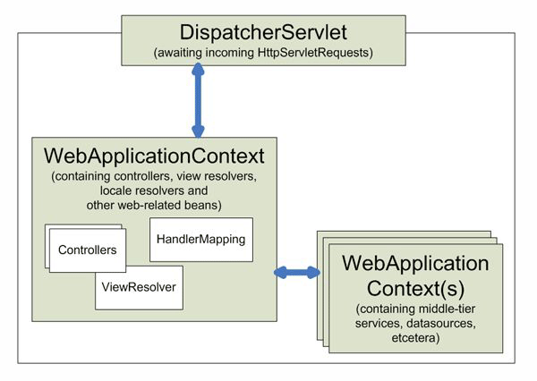
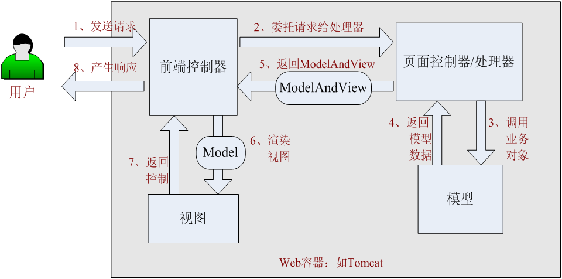

#SpringMVC概述
#一、整体工作流程

SpringMVC核心的类是`DispatcherServlet `，这个类是一个普通的Servlet类，负责接收请求然后分发给不同的`handler`进行请求处理，所以这个类又称为`前端控制器(Front Controller)`。

`DispatcherServlet`还负责在Web容器启动时创建`WebApplicationContext`的springIOC容器对象，并把SpringIOC容器对象存放到`ServletContext`中。

上图中还有其他spring-容器(如业务层，dao层对象)，与mvc容器对象为父子关系。

#二、SpringMVC整体工作流程

当前端控制器接收到请求后，通过某种机制把请求转换到Handler(又称为页面控制器)进行处理，处理器中调用业务层对象进行业务逻辑处理，然后生成一个ModelAndView对象给前端控制器，前端控制器根据ModelAndView对象产生此次请求的应答给客户端。

#三、9大策略接口
Springmvc定义好了整个请求处理流程，在整个过程中9大策略接口定义了其中可扩展的功能，我们提供这些接口不同的实现类就提供不同的实现策略，这种设计完全符合面向对象设计中的`开闭原则`。即整个流程不能修改，但能针对流程中各个节点提供不同的实现扩展。

##1、*HandlerMapping
此接口的功能是把一个请求`URL`和处理请求的`Handler`映射起来。

这里所谓的`Handler`可能是一个类，也有可能是多个类组成的Handler执行链(HandlerExecutionChain)。

SpringMVC并没有限制`Handler`必须是某个接口的实现，可以是任何类对象。

其接口中定义的方法是:

~~~java
HandlerExecutionChain getHandler(HttpServletRequest request) throws Exception;
~~~

其中的`HandlerExecutionChain`就是handler处理链。其中包含一个Handler类和多个拦截器(HandlerInterceptor)。

##2、*HandlerAdapter
当一个请求被SpringMVC接收后，通过`HandlerMapping`可以找到可以处理此请求的`Handler`，那么如何执行`Handler`，然后得到一个模型和视图(ModelAndView)，就是`HandlerAdapter`处理的事了。

`HandlerAdapter`接口中定义的方法是

~~~java
//此适配器是否能执行某个handler
boolean supports(Object handler);
//执行handler，返回modelAndView对象
ModelAndView handle(HttpServletRequest request, HttpServletResponse response, Object handler) throws Exception;

//获取请求资源最后修改时间
long getLastModified(HttpServletRequest request, Object handler);
~~~

其中`ModelAndView`包含一个模型和一个视图，通过模型和视图就可以针对这次请求生成应答了。

##3、*HandlerExceptionResolver
在Handler处理请求的过程中出现异常怎么办呢?我们还是需要一个应答，所以这个bean的作用就是在`handler`处理请求发生异常时负责生成的ModelAndView对象用于生成应答。

接口中方法定义是:

~~~java
ModelAndView resolveException(
			HttpServletRequest request
			, HttpServletResponse response
			, Object handler //执行请求的handler
			, Exception ex);//抛出的异常
~~~

##4、*ViewResolver
有时候请求处理完毕后得到的ModelAndView对象中没有完整的View对象，仅仅得到一个视图名称(viewName)，我们需要一种策略来通过名称得到对应的View对象，这就是ViewResolver此类的bean的工作。

接口定义的方法是:

~~~java
View resolveViewName(String viewName, Locale locale) throws Exception;
~~~

其中的`Locale`表示请求的区域，用于国际化时可以针对不同的区域返回不同的视图。下面有专门的bean用于获取请求的发出的区域对象。
##5、RequestToViewNameTranslator
又是还有更特殊的情况，在请求处理完毕后，`ModelAndView`中连viewName都没有，这是我们需要一种策略去获取当应答视图名称，springmvc会使用容器中的`RequestToViewNameTranslator`类型的bean来完成这个工作。

核心方法是:

~~~java
String getViewName(HttpServletRequest request) throws Exception;
~~~

##6、LocaleResolver
为了创建应答View，除了视图名称外，还需要区域对象，	`LocaleResolver`就是用于从请求中获取对应的Local对象的策略接口。

其核心方法是:

~~~java
Locale resolveLocale(HttpServletRequest request);
~~~
一个请求的区域通过可以通过请求头获取，但也不能排除还可以从从请求参数，请求url中获取。

##7、ThemeResolver

有时候我们希望针对不同的用户展示不同主题风格的视图，这时候就需要一种通过请求对象来获取对应的主题的名称的策略。ThemeResolver就用于此种目的。

~~~java
String resolveThemeName(HttpServletRequest request);
~~~

##8、MultipartResolver
有时候我们会有文件上传的功能需求，那么`MultipartResolver`这类型的bean就是干这个活的。

其提供的功能有:

~~~
//判断某个请求是否是文件上传请求
boolean isMultipart(HttpServletRequest request);
//解析此请求
MultipartHttpServletRequest resolveMultipart(HttpServletRequest request) throws MultipartException;
//上传完毕后的清理工作
void cleanupMultipart(MultipartHttpServletRequest request);
~~~

  
##9、FlashMapManager

主要辅助管理FlashMap对象。FlashMap是一HashMap的子类，主要用于保存需要在多个请求间共享的数据，常见的使用场景是在重定向前后的请求中共享数据。

#四、九大策略接口的默认实现

SpringMVC在`spring-webmvc.jar`下的`/org/springframework/web/servlet/DispatcherServlet.properties`文件中提供这9大策略接口的8个默认实现bean，其中MultipartResolver没有默认实现，因为不是所有项目都有文件上传功能的。

~~~properties
...省略部分包名

....LocaleResolver=
org.springframework.web.servlet.i18n.AcceptHeaderLocaleResolver

...ThemeResolver=
org.springframework.web.servlet.theme.FixedThemeResolver

....HandlerMapping=
....BeanNameUrlHandlerMapping,
....DefaultAnnotationHandlerMapping

....HandlerAdapter=
...HttpRequestHandlerAdapter,
...SimpleControllerHandlerAdapter,
...AnnotationMethodHandlerAdapter

....HandlerExceptionResolver=
...AnnotationMethodHandlerExceptionResolver,
...ResponseStatusExceptionResolver,
...DefaultHandlerExceptionResolver

...RequestToViewNameTranslator=
...DefaultRequestToViewNameTranslator

....ViewResolver=
...InternalResourceViewResolver

...FlashMapManager=
...SessionFlashMapManager
~~~

可以看到其中有些策略接口提供了有多个实现，哪么使用谁呢?
Spring中有一个Order接口中一个方法可以返回一个int值作为优先级，Springmvc默认把某个策略的实现对象按照优先级策略进行降序排序后，依次来采用，直到任务完成为止(责任链模式)。

