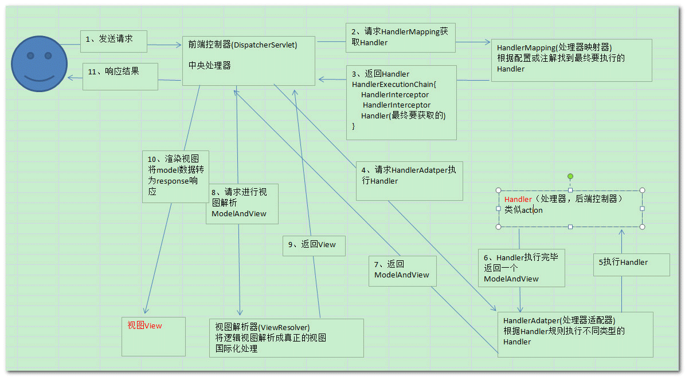

#详细的请求处理流程

#一、概述

SpringMVC整个流程是固定的，但各个中间节点可以不同的实现。
下面主要详细说明下默认的各个中间节点的详细实现。

#二、默认策略实现
当启用`<mvc:annotation-driven/>`或`@EnableWebMvc`后，默认会注册`RequestMappingHandlerMapping`，`RequestMappingHandlerAdapter`，`ExceptionHandlerExceptionResolver `等策略实现类。

#三、请求和Handler的映射(找到Handler)

`RequestMappingHandlerMapping`实现的策略是通过`@Controller`注解和`RequestMapping`注解两者一起决定当请求来时使用`@controller`类中的和`@RequestMapping`适配的方法进行请求处理。

此策略没有限制Handler的形式，可以是任何类型/任何方法签名。

此策略中的Handler含义为对象中的某个方法。

#四、执行Handler

通过上一步骤找到Handler(某个对象中的某个方法)，但spring没有规定方法的签名，即方法的签名可以是任何样子，则就导致要想执行此方法需要不同的是适配器，来保证方法的执行。

如:方法参数要注入请求中的参数，方法的返回值要转换为ModelAndView，执行方法出现异常如何处理等问题。

`RequestMappingHandlerAdapter`会执行handler，完成整个请求的处理，不管怎样(是否有异常)，最后返回一个ModelAndView的对象。过程中使用到如下子策略。
#4.1、方法参数识别
使用子策略`ParameterNameDiscoverer`进行参数名称识别，默认尝试从`class类型中`或参数上的`注解`获取。
#4.2、方法参数注入
使用子策略`HandlerMethodArgumentResolver`，策略中会使用到WebDataBinder对象。
WebDataBinder负责参数
#4.3、方法参数类型转换
两种选择`Formatter`或`ConversionService`。

#4.4、方法执行异常处理
使用子策略`HandlerExceptionResolver`进行处理，返回一个ModelAndView对象
#4.5、方法返回值处理
使用子策略`HandlerMethodReturnValueHandler`进行处理，设置Model和View。

#五、视图处理

当上一步骤返回ModelAndView对象后，一般仅包含视图名称和模型，我们需要把视图名称转换为对应的View对象，甚至有时候还要考虑国际化的情形。这个策略为视图解析器策略，默认策略是`InternalResourceViewResolver`。

默认是根据视图名称加上前缀和后缀来返回一个JSTLView对象，进行应答的处理。

#总结

整个请求的处理流程都是在前端控制器中的`DispatchServlet`的service方法中实现。详细流程如下:

