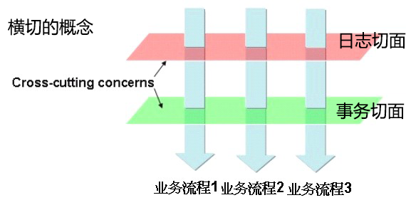

#AOP概念
#一、概述

AOP(Aspect Oriented Programming)，面向切面编程。
首先AOP是一种编程思想，是针对OOP的一种补充和完善，两者不是对立的关系。

其次AOP中所谓的切面(Aspect)是指完成同一个功能的多个代码片段，具体表现形式可能是一个类或多个类。

AOP的概念:
: 动态地将代码切入到类的指定位置上(一般是方法中)的编程思想就是面向切面的编程。其中的动态是相对于手动把代码写入类的某个位置。

#二、AOP术语
##*1、Target object(目标对象)
需要被切入的对象。	
##*2、AOP proxy(AOP代理对象)
根据切入对象生成代理对象。
##3、Join point:(连接点)
可以被切入的点，如方法执行，属性的设置或获取，构造器执行等。
##*4、Pointcut(切点)
一个表达式，用于筛选目标对象中的连接点作为实际切入的点。
##*5、Advice(通知) 
切入的代码。一般分为:

- Before advice(前置通知)
- After (finally) advice(后置通知) 
- After returning advice(返回后置通知)
- After throwing advice(异常后置通知)
- Around advice(环绕通知) 

##6、Introduction(引进)
动态的给某个类型增加属性或方法。一般是给代理对象增加。

Spring-AOP实现了给代理对象引进方法的功能。

##*7、Aspect(切面)
完成切入功能所需统称。如事务切面，日志切面等。

##8、Weaving(织入)
把切面连接到某个类或对象中的过程，称为织入。
有三个时机:

- (compile time)编译时期

	当一个类文件被编译时进行织入，这需要特殊的编译器才可以做的到，例如AspectJ的织入编译器。

- (classload time)类加载时期

	使用特殊的ClassLoader在目标类被加载到程序之前增强类的字节代码。
- (runtime)运行时

	Spring的AOP使用的是运行时，使用JDK的动态代理技术。

#三、AOP在项目中运用
我们根据OOP思想把不同的功能放入不同的类中，当执行不同的业务流程时会经过不同的类和方法，但这些不同的业务流程一般都会有一些非业务功能的通用逻辑，如日志，事务，安全，统计等。这时如果针对每个业务流程都去编写相应代码肯定是繁琐的。
这时就可以使用AOP横向的切入所有业务流程代码，织入非业务功能的通用逻辑代码，称为横切。

#总结
整个AOP关键点在于切入，那么可问出如下问题:

时间，地点，人物(谁切入谁)，做了什么，怎么做，为什么要做?

0. 什么时候切入?

	三个时期，参考`织入`	     

0. 有哪些切入位置选择?具体在哪个位置切入?

	连接点和切点

0. 谁切入?切入谁?切入了什么?

	我们把通知切入目标对象
	
0. 怎么切入?
	
	JDK动态代理，运行时字节码生成。加载时字节码嵌入等

0. 切入是为了什么?

	完成非业务功能逻辑，切面。